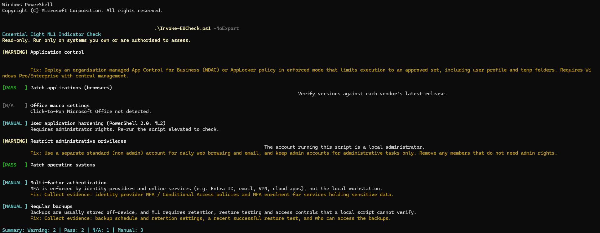

# Essential Eight ML1 Indicator Checker

A read-only PowerShell script that checks a Windows machine against selected
[ACSC Essential Eight](https://www.cyber.gov.au/resources-business-and-government/essential-cyber-security/essential-eight)
Maturity Level One indicators and produces a colour-coded console summary plus
CSV and HTML reports with remediation guidance.

## Why I built it

I work in IT support and am moving into cyber security. The Essential Eight is
the baseline most Australian organisations are assessed against, so I wanted to
understand each control properly: what it protects against, how it's
implemented on Windows, and how you'd gather evidence for it. Building a checker
forced me to learn where the evidence lives (CIM classes, the registry, Windows
features, group membership) and where a script *can't* give you a reliable answer.

## What it checks

| # | Essential Eight control | What the script looks at | Result |
|---|---|---|---|
| 1 | Application control | WDAC (App Control for Business) user-mode enforcement, Smart App Control state, AppLocker rules and the Application Identity service | Pass / Warning / Fail |
| 2 | Patch applications | Chrome, Edge and Firefox versions, flagging any older than the ML1 two-week window | Pass / Warning |
| 3 | Office macro settings | Office policy registry keys for Word, Excel and PowerPoint (internet macro blocking, `vbawarnings`, macro AV scanning) | Pass / Fail / N/A |
| 4 | User application hardening | Whether Windows PowerShell 2.0 is installed (an ML2 indicator; requires admin) | Pass / Fail / Manual |
| 5 | Restrict administrative privileges | Members of the local Administrators group, and whether the current account is one | Pass / Warning |
| 6 | Patch operating systems | Install date of the most recent Windows update (flagged if older than 30 days) | Pass / Fail |
| 7 | Multi-factor authentication | Reported for manual verification (see Limitations) | Manual |
| 8 | Regular backups | Reported for manual verification (see Limitations) | Manual |

## Requirements

- Windows 10 or 11
- Windows PowerShell 5.1 (built into Windows)
- Administrator rights are optional; only the PowerShell 2.0 check needs them

Tested on Windows 11 Home with Windows PowerShell 5.1.

## How to run

```powershell
git clone https://github.com/eatingmiko/essential-eight-checker.git
cd essential-eight-checker

# Allow locally created scripts to run (current user only, no admin needed)
Set-ExecutionPolicy -ExecutionPolicy RemoteSigned -Scope CurrentUser

# Run the checks and export CSV + HTML reports to .\reports
.\Invoke-E8Check.ps1

# Console summary only, no report files
.\Invoke-E8Check.ps1 -NoExport

# Save reports somewhere else
.\Invoke-E8Check.ps1 -OutputPath C:\Temp\E8Reports
```

Run from an elevated PowerShell window to include the PowerShell 2.0 check.

## Example output



**Status meanings**

- **Pass**: indicator meets the ML1 expectation
- **Fail**: indicator does not meet it; remediation provided
- **Warning**: partially meets it, or needs judgement (e.g. audit mode, reputation-based control)
- **Manual**: cannot be verified by a local script; collect evidence separately
- **N/A**: not applicable (e.g. Office not installed)
- **Error**: the check could not run; the reason is included

## Safety

- **Read-only.** The script only reads system state. It never changes settings.
  Remediation commands are shown as text and are never executed.
- The only files it writes are its own reports.
- **Only run it on systems you own or are explicitly authorised to assess.**
- Reports contain your hostname and account names. The `.gitignore` excludes
  them, so never commit them to a public repository.

## Limitations

- **This is an indicator check, not a formal Essential Eight maturity assessment.**
  A real assessment follows ASD's assessment process, tests controls rather
  than just reading configuration, and covers every requirement at each level.
- **MFA and backups need manual evidence.** MFA is enforced by identity
  providers and online services, not the local workstation. Backups are usually
  off-device, and ML1 requires retention, tested restores and access controls
  that a local script can't observe.
- **Application control:** `Win32_DeviceGuard` shows *whether* user-mode code
  integrity is enforced, not *which* policies are active. If Smart App Control
  is on, the script reports a Warning, because Smart App Control is
  reputation-based rather than an organisation-approved allow-list, even if an
  organisational policy is also present.
- **OS patching:** "most recent update within 30 days" is a proxy. It doesn't
  confirm every released patch is installed, and `Get-HotFix` doesn't list
  every update type.
- **Browser patching:** executable file age is used as a proxy for version age.
  Versions should be compared against each vendor's latest release.
- **Office macros:** only Click-to-Run Office and user-level (HKCU) policy keys
  are checked.
- Single machine only; no domain or fleet-wide view.

## Future improvements

- Domain-wide checks via Active Directory and PowerShell remoting
- Checks for Maturity Levels Two and Three
- Scheduled runs with Task Scheduler, tracking results over time
- List active WDAC policies with `CiTool.exe` when run elevated
- Compare browser and Office versions against vendor release feeds
- Machine-level (HKLM) Office policy and MSI Office detection
- Pester unit tests

## License

MIT. See [LICENSE](LICENSE).